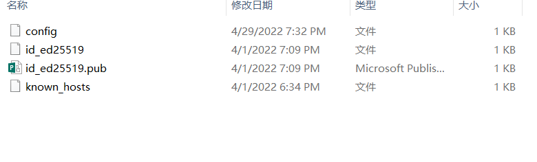
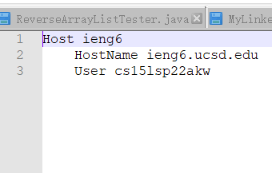
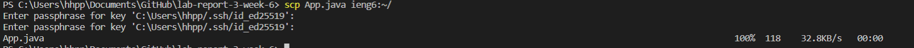
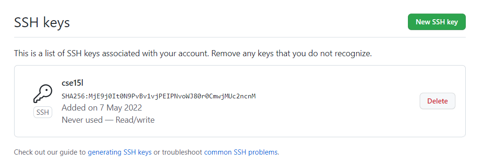
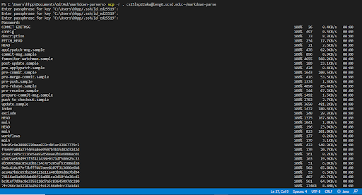
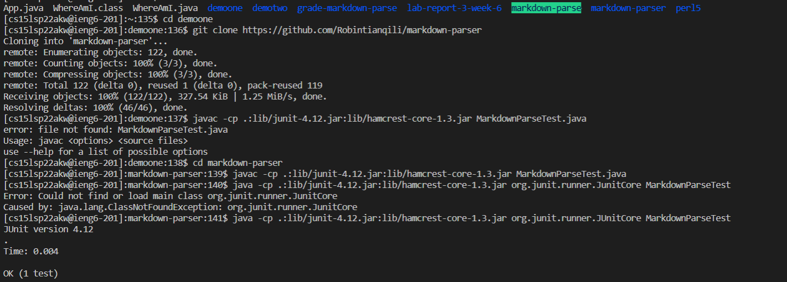

# Lab report 3

## 1. the ssh configuration

* firstly, find the .ssh file in the desktop

* create or find the file "config", and then write lines below:

`Host ieng6`

`HostName ieng6.ucsd.edu`

`User cs15lsp22zzz(replace zzz with someone's own username)`

*in this case, the alias is ieng6, HostName and User will indicate the remote server of the .ssh*

* in the terminal page, we can simply input ssh (Host) to log in the remote server. Then, we could use scp to upload the files.

  

## 2. Set up Github Access
* the new ssh key in Github website

* the private ssh key in my own computer

* running git commands to commit and change to github while log into the ieng6 server

[The link to the push](https://github.com/Robintianqili/lab-report-3-week-6/commit/907794a198e956570b491f05e3ff52e114ef2bfe) 

* description of setting up Github Access 

    We need to first create a key in the remote server, and copy the content and save it in github.com as public keys. Then after we commit in the remote server, we need to first check that we will push it as SSH keys, not Http. Finally we need to make sure that the ssh keys is in function by using ssh-add. 

## 3. copy whole directory by using scp recursively

*  copying your whole markdown-parse directory to your ieng6 account.

when copy directory, -r means "recursively", so scp command will pass through every file in the folder.

*  logging into your ieng6 account after doing this and compiling and running the tests for your repository.

* combining scp, ;, and ssh to copy the whole directory and run the tests in one line.

